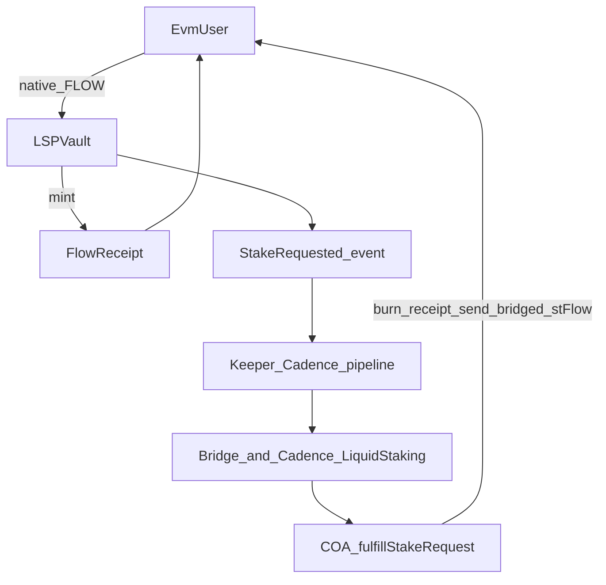
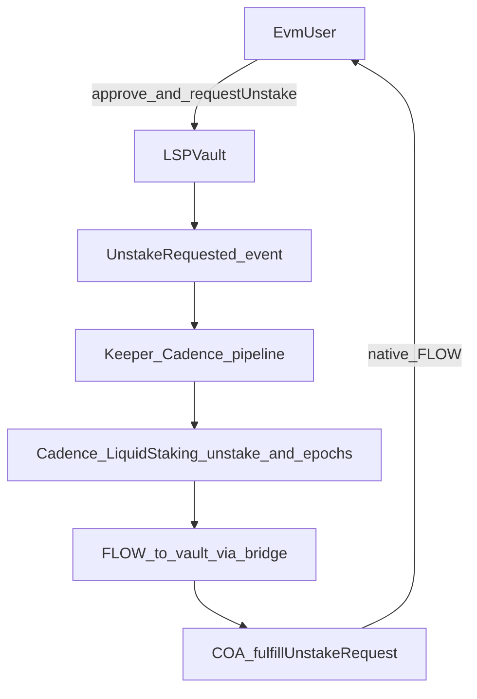
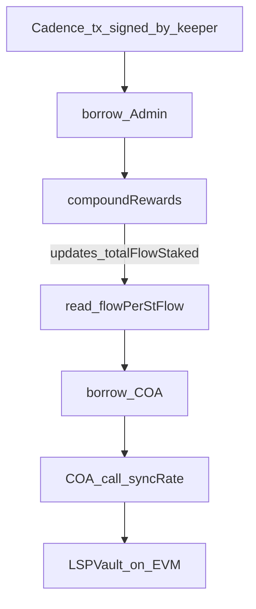

# Flow native liquid staking (Cadence + EVM + keeper)

This repo implements a minimal liquid staking protocol (LSP) for FLOW: users receive `stFlow` (Cadence fungible token) representing staked FLOW. Rewards compound into the exchange rate. An optional EVM vault accepts native FLOW from Flow EVM users via a receipt token and keeper-driven fulfillment.

Three moving parts:

1. **Cadence** — core staking, `stFlow` mint/burn, Flow `NodeDelegator`, reward compounding, unstake lifecycle.
2. **EVM** — `LSPVault` + `FlowReceipt`: request/fulfill pattern for users who interact only on Flow EVM.
3. **Keeper** — off-chain process that signs **Cadence** transactions only. EVM effects (vault fulfill, `syncRate`, `updateConfig`) happen when those Cadence transactions borrow the **COA** and perform `EVM` calls from Cadence, not from a separate EVM wallet operated by the keeper.

---

## Who owns what (control plane)

| Actor / object | Owns or controls |
|----------------|------------------|
| **Protocol admin Cadence account** | The deployed `LiquidStaking` and `stFlowToken` contracts, storage at `LiquidStaking.AdminStoragePath`, the `NodeDelegator`, withdraw pool, and fee routing into `/storage/flowTokenVault`. This account is the **source of truth for protocol governance**: pause, fee, compounding entrypoints, delegator registration, and unstake processing are all Cadence resources/functions on this account. |
| **COA** (`EVM.CadenceOwnedAccount` saved under `/storage/evm` on that **same** admin account) | The EVM identity whose address is `Ownable` on `LSPVault` (and thus controls `FlowReceipt` via the vault). Only Cadence code running as that account can deploy or call the vault as owner. |
| **Users** | Their Flow account storage (FLOW / `stFlow` vaults) and, on EVM, their EOAs and token approvals toward `LSPVault`. |
| **Keeper bot** | Off-chain automation that signs **Cadence** transactions on a schedule or in reaction to events. Its job is **operations** (compounding, moving unstaked FLOW through the pipeline, EVM fulfillments and `syncRate` via the COA). It does **not** define protocol policy: fee levels, pause, delegator choice, and contract upgrades remain **admin** concerns. |

**Important:** Governance and custody of the `LiquidStaking.Admin` resource and COA live with the **protocol admin Cadence account**. The keeper is a separate *role* in the architecture: it runs repetitive, time-gated work so the admin does not have to do it manually. If the keeper is offline, Cadence user staking/unstaking paths still work where they do not depend on the bot; EVM fulfillment queues and epoch housekeeping may stall until automation (or the admin) runs again.

**Disclaimer (proof of concept in this repo):** Admin and keeper are **intended** to be different principals (multisig or cold admin vs hot automation key). In the current code, **they are the same on-chain access**: every `admin/` and `keeper/` transaction borrows `&LiquidStaking.Admin` from `signer.storage` at `LiquidStaking.AdminStoragePath`, and COA calls use `/storage/evm` on the **same** signer. There is no capability or separate `Keeper` resource yet, so whoever key signs those txs must be the account that holds `Admin` and the COA. A production setup would publish **restricted** capabilities (or a dedicated keeper resource) so the automation key cannot change fees, pause, or register delegators.

---

## 1. Cadence contracts

| Contract | Role |
|----------|------|
| `stFlowToken.cdc` | FungibleToken-compliant liquid staking token; mint/burn gated to the same account as `LiquidStaking`. |
| `LiquidStaking.cdc` | Holds protocol accounting (`totalFlowStaked`), admin resource, `NodeDelegator` in storage, withdraw pool for unstaked FLOW, and public `stake` / `unstake` / `cashout`. |

**Exchange rate (Cadence)**  
`flowPerStFlow = totalFlowStaked / stFlowToken.totalSupply` (and inverse for minting on stake). Compounding increases `totalFlowStaked` without minting new `stFlow`, so each `stFlow` gradually represents more FLOW.

**Staking (Cadence user)**  
User sends FLOW into `LiquidStaking.stake`, which delegates via `FlowIDTableStaking.NodeDelegator`, bumps `totalFlowStaked`, and returns a `stFlow` vault.

**Unstaking (Cadence user)**  
User calls `LiquidStaking.unstake` with an `stFlow` vault: tokens burn, the delegator requests epoch unstake, `totalFlowStaked` decreases, and a **pending** unstake record is stored. After at least one epoch boundary, the keeper runs `processUnstakes` (admin), which pulls FLOW from the delegator’s unstaked bucket into the protocol withdraw pool and moves records to **ready**. The user then calls `cashout` with their request id to receive FLOW into their FLOW receiver.

There is no instant “quick unstake” in this minimal design: exits follow Flow’s normal staking cooldown.

---

## 2. EVM contracts

| Contract | Role |
|----------|------|
| `FlowReceipt.sol` | ERC-20 “receipt” minted to the user immediately on `requestStake`; burned when the stake is fulfilled. |
| `LSPVault.sol` | Holds native FLOW and locked bridged `stFlow`; exposes `requestStake`, `requestUnstake`, and **owner-only** `fulfillStakeRequest`, `fulfillUnstakeRequest`, `syncRate`, `updateConfig`. Owner is the **COA** (Cadence Owned Account) EVM address after deployment from Cadence. |

**Staking (EVM user)**  
User calls `requestStake` with native FLOW. The vault records a pending stake, mints **receipt** tokens at the vault’s cached rate, and emits an event. The user does **not** receive VM-bridged `stFlow` in the same transaction.

**What the keeper does for EVM stake**  
Observes the stake event (or polls pending state), then submits **`cadence/transactions/keeper/fulfill_evm_stake_bundle.cdc`**: one Cadence transaction pulls native FLOW from the vault to the COA, stakes on Cadence, bridges stFlow to Flow EVM via the official Flow EVM bridge, transfers ERC‑20 stFlow into `LSPVault`, and the COA calls `fulfillStakeRequest` (receipt burned, user paid).

**Unstaking (EVM user)**  
User approves and calls `requestUnstake`; bridged `stFlow` is pulled into the vault and an unstake request is recorded.

**What the keeper does for EVM unstake**  
**Tx 1:** `fulfill_evm_unstake_start_bundle.cdc` — pull locked stFlow from the vault to the COA, bridge EVM→Cadence, `LiquidStaking.unstake`. **Wait** for the staking epoch, then **`process_unstakes.cdc`** (epoch housekeeping for all pending unstakers). **Tx 3:** `fulfill_evm_unstake_finalize_bundle.cdc` — ready FLOW to COA, fund `LSPVault`, `fulfillUnstakeRequest(id, flowAmount)`.

---

## 3. Keeper bot

The keeper is **not** a trustless chain primitive; it is an automation account (or service) that submits **deterministic**, auditable **Cadence** transactions when on-chain conditions say it is safe to proceed. All keeper duties described below are **Cadence-layer** operations (including any EVM vault calls performed **inside** those transactions via the COA). The keeper does not need its own EVM private key for protocol maintenance if the COA path is used exclusively.

Typical responsibilities:

**Per epoch (Cadence-first)**  
- Call `compound_and_sync.cdc` (compounds rewards and optionally `syncRate` on `LSPVault` in one tx) so rewarded FLOW is split: protocol fee to treasury, remainder restaked via `delegateRewardedTokens`, updating `totalFlowStaked`.  
- Optionally in the same Cadence transaction: COA `call` on `LSPVault.syncRate` so the EVM vault’s `_rate` matches `LiquidStaking.flowPerStFlow()` scaled to 18 decimals (see `cadence/transactions/keeper/compound_and_sync.cdc`).

**After epoch boundary (unstakes)**  
- Call `process_unstakes.cdc` so FLOW moves from the delegator’s unstaked bucket into the withdraw pool and pending Cadence unstake requests become ready.

**EVM queue**  
- Index `StakeRequested` / `UnstakeRequested` from `LSPVault`.  
- Stake: `fulfill_evm_stake_bundle.cdc`. Unstake: `fulfill_evm_unstake_start_bundle.cdc`, then after the epoch `process_unstakes.cdc`, then `fulfill_evm_unstake_finalize_bundle.cdc`.

**Operational notes**  
- In this POC the bot signs as the same account that holds `Admin` and the COA (see **Disclaimer** under **Who owns what**). Vault `onlyOwner` on EVM is the COA.  
- Liveness and ordering are operational risks (delayed fulfillment), not authorization to steal funds, if contracts enforce amounts and destinations.

---

## Flow-EVM diagram

### EVM: stake with keeper fulfillment

### EVM: unstake with keeper fulfillment

### Keeper: `compound_and_sync` (Cadence + EVM rate)

One Cadence transaction: compound rewards on `LiquidStaking`, then COA calls `syncRate` on `LSPVault` so the EVM vault’s cached rate tracks `LiquidStaking.flowPerStFlow()` (scaled to 18 decimals in the transaction script).

---

## Admin: protocol setup and node delegation

This is the **protocol admin Cadence account** (see **Who owns what**): it holds `LiquidStaking.Admin`, the COA, and deployed Cadence contracts.

**One-time / rare Cadence admin actions**  
- Deploy `stFlowToken` and `LiquidStaking` to the **same** Flow account (`access(account)` mint on `stFlow` requires this).  
- `register_delegator.cdc`: registers a `FlowIDTableStaking.NodeDelegator` for a chosen **node ID** and initial committed FLOW (subject to Flow minimums). This must succeed during a staking-enabled phase.  
- `setup_coa.cdc`: creates `EVM.CadenceOwnedAccount` at `/storage/evm` for deploying and owning EVM contracts.  
- Onboard Cadence `stFlowToken` through the **Flow EVM bridge** so you have the **bridged stFlow ERC‑20 address** (required by `LSPVault`’s constructor).  
- Deploy `LSPVault` via `deploy_evm_contract.cdc` (bytecode without `0x` for `decodeHex`; constructor args must include that ERC‑20 address), then point the keeper at the deployed vault address.

**Config across Cadence and EVM**  
- `update_liquid_staking_and_evm_vault.cdc` updates `LiquidStaking` fee + pause and calls `LSPVault.updateConfig` in one transaction (COA + admin).

**Scripts**  
- `cadence/scripts/get_price.cdc` — Cadence rate view.  
- `cadence/scripts/get_tvl.cdc` — TVL and fee snapshot.